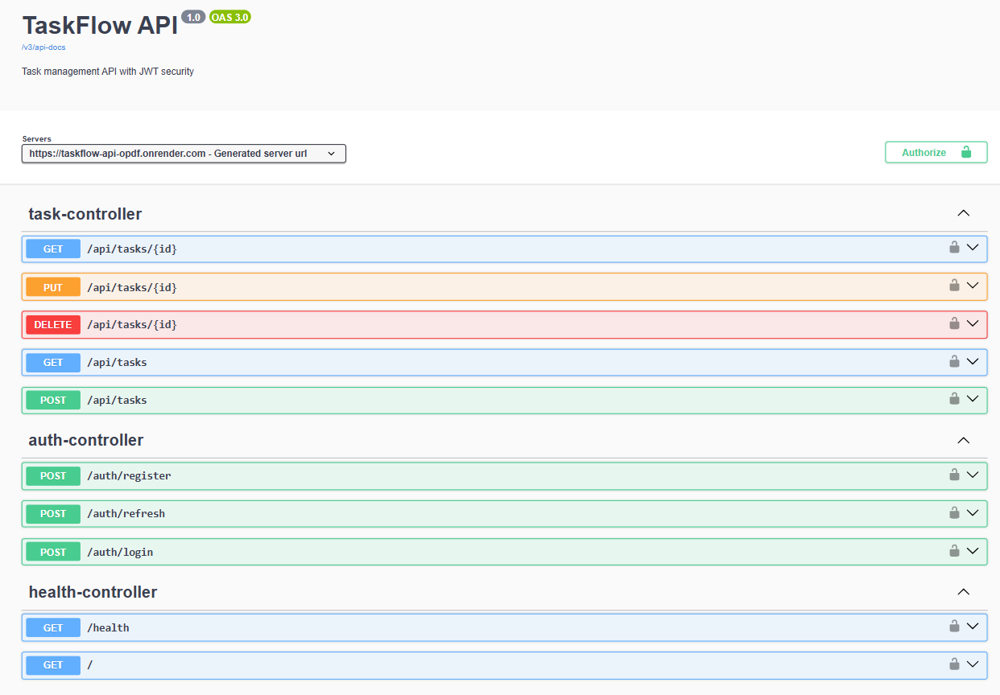

# TaskFlow API


Production-ready task management REST API built with Spring Boot, featuring JWT authentication, RBAC authorization, PostgreSQL persistence, Docker containerization, and CI/CD deployment on Render.

---
## Live Demo

API Base URL:
https://taskflow-api-opdf.onrender.com/  
---
## API Documentation

Swagger UI:  
https://taskflow-api-opdf.onrender.com/swagger-ui/index.html

---
## Project Overview

TaskFlow API is a secure backend application for task management.

The system supports:
- JWT authentication
- Role-based authorization
- Task ownership protection
- CRUD task operations
- Admin-level access control
- RESTful API architecture

---
## Features

### Authentication & Security
- JWT-based stateless authentication
- BCrypt password encryption
- Secure REST API endpoints
- Spring Security integration

### Authorization
- Role-Based Access Control (RBAC)
- USER and ADMIN roles
- Task ownership validation
- Method-level security with @PreAuthorize

### Task Management
- Create, update, delete tasks
- Retrieve personal tasks
- Admin access to all tasks

### API Design
- DTO-based architecture
- Global exception handling
- Validation with @Valid
- Standardized API responses

---
## Security Features

- Stateless JWT authentication
- Role-based access control (RBAC)
- BCrypt password hashing
- Endpoint authorization
- Ownership-based resource protection
- Secure token validation

---
## Tech Stack

| Technology | Purpose |
|---|---|
| Java 21 | Core language |
| Spring Boot | Backend framework |
| Spring Security | Authentication & authorization |
| JWT | Stateless authentication |
| PostgreSQL | Relational database |
| Hibernate / JPA | ORM |
| Maven | Build tool |
| Swagger/OpenAPI | API documentation |
| Docker | Containerization |
| GitHub Actions | CI/CD automation |
| Render | Cloud deployment |

---

## Architecture

The project follows a clean layered architecture:

Controller → Service → Repository → Database

### Security Flow

JWT Token → JwtFilter → SecurityContextHolder → Authorization

---


# 📦 API Endpoints

## Authentication

| Method | Endpoint | Description |
|---|---|---|
| POST | `/auth/register` | Register new user |
| POST | `/auth/login` | Login and receive JWT token |
| POST | `/auth/refresh` | Refresh access token |

---

## Tasks

| Method | Endpoint | Description |
|---|---|---|
| GET | `/api/tasks` | Get tasks |
| GET | `/api/tasks/{id}` | Get task by ID |
| POST | `/api/tasks` | Create task |
| PUT | `/api/tasks/{id}` | Update task |
| DELETE | `/api/tasks/{id}` | Delete task |

---
## System

| Method | Endpoint | Description |
|---|---|---|
| GET | `/` | API information endpoint |
| GET | `/health` | Health check endpoint |

- The root endpoint provides basic API information and service status.
- The `/health` endpoint is used for deployment monitoring and uptime checks.
---
# 🔑 Authentication Flow

1. Register or login
2. Receive JWT token
3. Add token to Authorization header: Bearer <your-token>
4. Access secured endpoints

---
## Screenshots

### Swagger UI



---


# 👥 Roles

## USER
- Can manage own tasks only

## ADMIN
- Can access all tasks
- Can update/delete any task

---


## 🧪 Running Locally

### 1. Clone Repository

```bash
git clone <repo-url>
cd taskflow-api
```

### 2. Setup PostgreSQL Database

```sql
CREATE DATABASE taskflow;
```

### 3. Configure Environment

Update `application.properties`:

```properties
spring.datasource.url=jdbc:postgresql://localhost:5432/taskflow
spring.datasource.username=YOUR_USERNAME
spring.datasource.password=YOUR_PASSWORD
```

### 4. Run the Application

```bash
mvn spring-boot:run
```

### 5. Access Swagger UI

http://localhost:8080/swagger-ui/index.html


---

## Docker Support

The application is fully containerized using Docker and Docker Compose.

### Run with Docker
```bash
docker-compose up --build
```
### Services
- Spring Boot API
- PostgreSQL database
### Docker Features
- Multi-container setup
- Environment variable support
- Persistent PostgreSQL storage
- Production-ready configuration

---

## CI/CD Pipeline

The project includes a CI/CD pipeline using GitHub Actions.

Pipeline features:
- Automated Maven build
- Dependency installation
- Project packaging
- Docker image build
- Deployment-ready workflow

---

## Deployment

The application is deployed on Render using automatic deployment from GitHub.

### Deployment Features

- Automatic deploy on push
- Cloud-hosted PostgreSQL
- Environment variable management
- Continuous delivery workflow

### Production Stack

Client → Render → Spring Boot API → PostgreSQL


---
## 📌 Project Status

### Completed
- JWT authentication
- RBAC authorization
- CRUD APIs
- PostgreSQL integration
- DTO architecture
- Validation
- Global exception handling
- Ownership authorization
- Pagination & sorting
- Refresh token system
- Docker deployment
- CI/CD pipeline


### Planned Improvements

- Unit & integration testing
- Redis caching
- API rate limiting
- Structured logging & monitoring
- Kubernetes deployment
- Email verification
- API versioning

---

## 👨‍💻 Author

Xiaoxu  
Software Developer